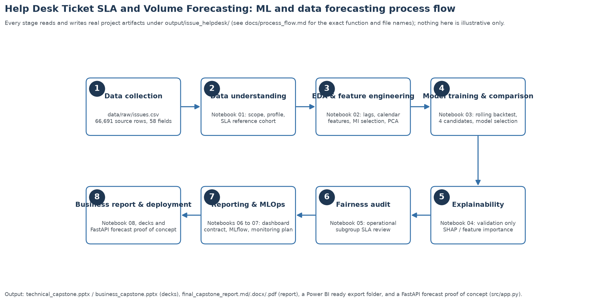

# Helpdesk Ticket SLA and Volume Forecasting

> **Repository update, 1 October 2026:** this submission is now hosted at
> [Heldpdesk_SLA_VolForecast_AIM_capstone](https://github.com/iristacey/Heldpdesk_SLA_VolForecast_AIM_capstone).
> [New-repository run #2](https://github.com/iristacey/Heldpdesk_SLA_VolForecast_AIM_capstone/actions/runs/36838533719)
> passed at commit `744b0770a5426dbee5be86a657aed44127057d75`, before this synchronized update.
> Runs #10, #15, #17 and #30 cited in supporting documents are historical
> evidence from the previous repository, not runs in this one.
> The synchronized files need their own successful CI run after upload.

This is the **main GitHub submission README**. It introduces the research, explains how to reproduce it, and links to the final deliverables. The [data README](data/README.md), [presentations README](presentations/README.md), and [output README](output/README.md) provide supporting detail.

> **Validation status:** all eight notebooks completed with the actual project `.venv` kernel after the recursive-calendar correction. The earlier suite passed **39/39 tests in a clean LOCAL submission copy**, using the existing `.venv`, without the raw CSV, `mlflow.db`, or editor/cache/archive folders. The expanded local suite subsequently passed **52 tests without skips**. The repository is now public at [Heldpdesk_SLA_VolForecast_AIM_capstone](https://github.com/iristacey/Heldpdesk_SLA_VolForecast_AIM_capstone), and [the new repository's run #2](https://github.com/iristacey/Heldpdesk_SLA_VolForecast_AIM_capstone/actions/runs/36838533719) passed at commit `744b0770a5426dbee5be86a657aed44127057d75`. Lightweight CI includes skipped tests and does not establish full-analysis reproduction in a fresh dependency environment. Validation selects **XGBoost at 7 days** and **ETS at the primary 30-day horizon**. The actual localhost HTTP demonstration also passed. These are historical results, not operational validation.

 **Responsible-use boundary:** this is an academic research prototype based on historical data ending **14 March 2023**. It is not a live SLA-compliance system, a validated staffing tool, or evidence of current help-desk performance. Source identity is now verified against public release evidence; daily completeness, the source date-range discrepancy and service-policy assumptions remain unresolved.

**Start here:** [Final report](output/issue_helpdesk/reports/final_capstone_report.md) · [Technical deck](presentations/technical_capstone.pptx) · [Business deck](presentations/business_capstone.pptx) · [Poster PDF](presentations/capstone_poster.pdf) · [Eight notebooks](notebooks/)

## Contents

- [Project brief, objectives and ML tasks](#project-brief)
- [Dataset](#dataset) and [project workflow](#project-workflow)
- [Process flow](#process-flow)
- [Repository structure](#repository-structure)
- [Methodology](#methodology), [models](#models-evaluated), [validation comparison](#validation-comparison) and [uncertainty](#forecast-uncertainty)
- [Explainability](#explainability), [ethical AI](#ethical-ai-bias-and-fairness) and [safeguards](#risks-and-safeguards)
- [Installation](#installation) and [downloading the dataset](#downloading-the-dataset)
- [Reproducing the analysis](#reproducing-the-analysis)
- [Presentations and poster](#presentations-and-poster)
- [Technical Jupyter/PyCharm walkthrough](#running-the-technical-jupyterpycharm-python-presentation)
- [Exporting](#exporting) and [repository validation](#repository-validation)
- [Final submission deliverables](#final-submission-deliverables)
- [Dockerized deployment and MLOps POC](#dockerized-deployment-and-mlops-poc)
- [Demonstration](#demonstration), [responsible use](#responsible-use-statement) and [generative AI scope](#generative-ai-scope-decision)
- [Author](#author) and [acknowledgment and citation](#acknowledgment-and-citation)

## Project brief

Helpdesk planning requires both an understanding of past service outcomes and an estimate of future demand. This project joins two complementary workstreams: retrospectively compare completed tickets against priority-based resolution-time references, and forecast daily ticket arrivals over separate 7- and 30-day horizons.

The intended audience are service managers and workforce/capacity planners, supported by technical reviewers who need traceable data preparation, model comparisons and limitations. Forecasting helps in identifying staffing requirements to address volume and demand, and retrospective review of performance surfaces opportunities to improve service based on SLA attainment. The project demonstrates an analytical workflow; it does not demonstrate that using its forecasts improves staffing costs or service outcomes.

### Objectives

1. Profile the source, document its schema and quality, and define a reproducible ticket cohort.
2. Quantify retrospective reference attainment using explicit priority mappings and elapsed-time rules.
3. Compare statistical and machine-learning forecasts against a seasonal baseline using chronological validation and test periods.
4. Explain XGBoost behavior, audit operational-group differences, and communicate uncertainty and ethical limits.
5. Package reproducible notebooks, a persisted model, experiment tracking, a local serving POC, two audience-specific decks and a poster.

### ML tasks

| Workstream | Task and target | Evaluation |
|---|---|---|
| Retrospective SLA-reference analysis | Descriptive analysis of elapsed resolution time against project-defined priority thresholds; **not a classifier** | Reference-met counts/rates, eligible denominators, priority/year/project breakdowns |
| Daily ticket-volume forecasting | Univariate time-series forecasting / supervised regression of exact `Ticket` arrivals per UTC day | Validation MAE for selection; held-out MAE, RMSE, WAPE, sMAPE, signed bias and interval coverage |

The 30-day forecast is **30 daily counts**, not one monthly total. No individual-ticket breach prediction, automated staff appraisal, or generative-language task is implemented.

### Research and business acceptance criteria

**Research acceptance criterion:** select by validation MAE separately at 7 and 30 days, then require lower held-out MAE than the same-weekday seasonal baseline at each horizon, with RMSE, bias and interval coverage disclosed. The corrected run meets this historical criterion: selected-model test MAE is 5.05 versus 6.41 at 7 days and 4.67 versus 6.49 at 30 days. Baseline advantage is not evidence of business benefit or owner-approved operational acceptance.

**Proposed business success criterion (not measured or owner-approved):** in a human-reviewed pilot, reduce overtime hours per 100 tickets by **at least 10%** versus a matched baseline, without worsening an owner-approved service-attainment rate. Before the pilot, approve the ticket denominator, overtime and service-clock definitions, comparison period and matching rules, costs, and stop conditions; obtain current representative data. The historical SLA-reference rate is not an approved service KPI, and no savings or ROI has been measured.

## Dataset

**Sources:** [Help Desk Tickets (Mendeley Data), Kaggle](https://www.kaggle.com/datasets/janebitor/help-desk-tickets-mendeley-data) and [Help Desk Tickets, Mendeley Data, version 2](https://data.mendeley.com/datasets/btm76zndnt/2).

The Mendeley listing describes masked records from a help-desk team at an international software company. This capstone uses **`issues.csv` only**; companion message, snapshot and assignment-history datasets are not required.

| Property | Current working extract |
|---|---|
| Local input | `data\raw\issues.csv` |
| Raw size | 66,691 rows, 58 fields |
| Forecast scope | Exact `issue_type == "Ticket"`, created on/after 2016-01-01 UTC |
| Scoped arrivals | 27,348 Ticket records |
| Daily series | 2,628 calendar days, 2016-01-03 through 2023-03-14 |
| Dates with no scoped record | 344 (13.1%); assumed zero arrivals, not independently verified |
| Eligible resolved SLA cohort | 16,735 completed tickets |
| Key quality findings | Pre-2016 creation dates, 853 missing resolution dates, 46.55% missing assignee values, sparse workflow-duration fields |

The published description gives January 2016–March 2023, but the local extract contains creation timestamps as early as 2007-04-15. Earlier records are profiled and excluded from the primary scope. Missing workflow values are not indiscriminately converted to zeros.

**Source identity verified, 30 September 2026:** local `issues.csv` is byte-for-byte identical to the freshly downloaded **Kaggle version-1** member. Both its SHA-256 and **20,586,538-byte** size match the official **Mendeley version-2** file metadata. The [verification record](data/source_verification.json) retains URLs, file identifiers, hashes and method. Direct Mendeley binary retrieval returned HTTP 403; the Mendeley comparison uses its published cryptographic digest, not a separately downloaded Mendeley CSV.

The pre-2016 creation timestamps are therefore present in the identified public file, not evidence of an unidentified local alteration. The public `FEATURES.md` repeats the 2016–2023 description but does not explain the mismatch or prove daily completeness.

See the [source card](data/README.md), [58-field dictionary](output/issue_helpdesk/data_dictionary.csv), [dataset manifest](output/issue_helpdesk/dataset_manifest.json), and [coverage audit](output/issue_helpdesk/daily_coverage_audit.csv).

### Missing-date sensitivity

A [reproducible supplementary stress test](output/issue_helpdesk/volume_forecast/coverage_sensitivity/summary.json) treats all **344 zero-record dates** as potentially missing. It replaces only training-history zeros using the median of up to four earlier positive same-weekday counts within 56 days, falling back to earlier positive counts in that window. No future observations or previously imputed values enter the replacement statistic. ETS, XGBoost and seasonal naive are refitted at the original rolling origins; Ridge is outside this bounded check.

Both scenarios are scored on the **same positive-record target dates**, never on imputed labels. The [complete metrics](output/issue_helpdesk/volume_forecast/coverage_sensitivity/metrics.csv) also show the original all-calendar scores separately.

| Canonical selected model | Test MAE, original training, positive targets | Test MAE, missing-record stress training, same targets |
|---|---:|---:|
| XGBoost, 7 days | 5.1241 | 5.1781 |
| ETS, 30 days | 4.7510 | 4.7897 |

**Interpretation:** those errors change by about 1.1% and 0.8%, and both remain below the corresponding seasonal baseline. However, excluding zero-record validation targets changes the 7-day ranking: ETS scores **4.3398**, versus XGBoost **4.4408**, even before changing the training data. ETS is also best among the three tested families under stress at both horizons. The original 7-day selection is therefore **sensitive to the scored population**, not universally robust.

This is post-hoc sensitivity evidence, not a replacement selection experiment or a fresh holdout. Positive-record days may themselves be incomplete; removing zero dates changes the question being scored and can introduce selection bias. Completeness is still unproven, overlapping month-ahead windows are not independent, and the canonical **7-day XGBoost / 30-day ETS** selections and API artifact remain unchanged.

## Project workflow

```text
issues.csv
  -> 01 Source understanding and scope
  -> 02 EDA, feature engineering, MI selection and PCA
  -> 03 Rolling-origin model comparison and persistence
  -> 04 XGBoost explainability and tuning diagnostics
  -> 05 Operational-group bias/fairness audit
  -> 06 Reporting contract and Power BI-ready exports
  -> 07 MLflow tracking and historical monitoring
  -> 08 Business interpretation, decision gates and ROI limits
  -> Report, technical/business decks, poster and local API demonstration
```

The [detailed process flow](docs/process_flow.md) maps scripts to artifacts. Analysis outputs live under `output\issue_helpdesk`; all active presentation material lives in **`presentations`**.

## Process flow

The diagram below shows how the source data moves through preparation, model comparison, explanation, auditing and final reporting. Read the top row from left to right, then follow the arrows along the bottom row from right to left. The numbered boxes represent process stages, not individual notebook numbers; the reporting/MLOps stage combines Notebooks 06 and 07.

[](output/issue_helpdesk/process_flow_diagram.png)

**Two linked analytical paths:** scoped daily arrivals feed the forecasting experiment, while eligible resolved tickets feed the retrospective SLA-reference assessment. Their outputs support the report, technical and business decks, poster and Power BI-ready package. The persisted forecast model also supports the local FastAPI demonstration; this does not imply production readiness.

Open the [full-size diagram](output/issue_helpdesk/process_flow_diagram.png) for a closer view, or see the [detailed process-flow documentation](docs/process_flow.md) for the exact notebook functions, file paths and artifact dependencies. The diagram is generated by [`src\generate_process_flow_diagram.py`](src/generate_process_flow_diagram.py).

## Repository structure

```text
README.md                          Main GitHub submission guide
Makefile                           install/lint/test/notebooks/ci shortcuts
pyproject.toml                     Ruff lint configuration
test_qa_assistant                  Standalone pytest-style check for qa_assistant.py
configs\
  project_config.yaml              Scope, SLA mapping and forecast configuration
data\
  README.md                        Source documentation and caveats
  raw\issues.csv                   Download separately; excluded from Git
notebooks\                         Eight ordered technical notebooks
src\
  issues_capstone.py               Analysis, forecasting, tracking and reporting
  app.py                           FastAPI deployment POC
  qa_assistant.py, qa_cli.py       Keyword-matching README/docs Q&A stub (not an LLM)
  live_review.py                   Lightweight generated-text sanity checker
  generate_*.py                    Notebook/figure/deck/poster/report/deployment-demo generators
models\
  final_volume_forecast_model.joblib
  final_volume_forecast_model_metadata.json
presentations\                     Poster, decks, narrative, charts and generators
  technical_slides.md              Condensed slide source for the reveal.js/Beamer export
  technical_reveal_deck.html       Generated reveal.js technical deck
  technical_reveal_deck_beamer.tex Generated Beamer source (not compiled to PDF locally)
output\
  issue_helpdesk\
    volume_forecast\               Canonical predictions, metrics, selection and ICE summary
    powerbi\                       Export tables, report specification and samples
    reports\                       Final report, EDA + Feature Engineering report (MD/HTML/PDF/DOCX)
docs\                              Process flow, monitoring, versioning/rollback and submission-verification guidance
  media\                           Deployment demo GIF
tests\                             Project contracts, poster/package checks and QA-assistant/smoke tests
.github\workflows\tests.yml         Python and Docker test jobs
.github\workflows\ci.yml            Lint, pytest and notebook-parse checks
Dockerfile                         Lightweight test and full analysis targets
requirements.txt                   Full analysis dependencies
requirements-test.txt              Pinned lightweight test dependencies
requirements-report.txt            Report-export system prerequisites
```

`mlflow.db` and `mlruns` are regenerable, gitignored local tracking stores. The capstone uses `issues.csv`.

## Methodology

### Retrospective service reference

Eligibility requires exact `Ticket` type, the documented 2016+ window, resolution outcome `Done`, known mapped priority, and a valid nonnegative creation-to-resolution duration.

| Recorded priority | Project tier | Reference | Met / assessed | Met rate |
|---|---|---:|---:|---:|
| Blocker / Highest | Critical | 4 hours | 524 / 2,124 | 24.7% |
| High | High | 8 hours | 576 / 3,146 | 18.3% |
| Medium | Medium | 24 hours | 2,161 / 11,161 | 19.4% |
| Low / Lowest | Low | 24 hours | 72 / 304 | 23.7% |
| **Overall** | | | **3,333 / 16,735** | **19.92%** |

Unknown priorities are excluded, not mapped to a default. The clock is **elapsed UTC wall-clock time**, not a verified business-hours or pause-adjusted SLA clock. Thresholds are project-configured references, not approved contractual policy. Workflow duration fields remain diagnostics rather than substitutes for the resolution clock.

### Forecast preprocessing and evaluation design

Parse creation timestamps as UTC, filter the scoped Ticket cohort, and count arrivals per calendar day. Zero-fill missing dates only under the recorded completeness assumption. Engineer 28 prior-day lags, 7-/28-day trailing means, and cyclical weekday/year features: **34 candidate features**, built from preceding history and calendar information.

Feature selection, scaling and PCA are fitted on the training history available at each origin. Ridge uses mutual-information selection (up to 10 features), standardization, PCA retaining at least 95% of selected-feature variance, and regularized regression. PCA variance is **feature variance**, not a percentage of target variance explained.

The experiment uses expanding-window origins spaced seven days apart, with a 365-day validation period followed by a disjoint 365-day final-test period. Forecast windows must fit inside their split. The minimum configured training history is 365 days; only origins within validation/test contribute reported scores.

There are 52 validation / 51 test origins for the 7-day horizon and 48 / 48 for the 30-day horizon. Month-ahead windows overlap, so pooled scores are not results from 48 independent months. At later origins, previously observed days enter the expanding history; outcomes after an origin are not training observations at that origin.

Model selection is by **lowest validation MAE separately per horizon**, never by final-test rank. The selected primary-horizon model is subsequently refitted on all available history for persistence; its reported test score comes from the earlier rolling backtest, not from scoring that full-history refit on its own training data.

## Models evaluated

| Candidate | Design and role |
|---|---|
| Seasonal naive | Repeat the preceding week's same-weekday counts; baseline |
| Weekly additive ETS | Exponential smoothing with additive trend and seven-day seasonality; interpretable statistical candidate |
| XGBoost autoregression | Recursive lag/calendar forecasts; selected at 7 days, challenger at 30 days |
| MI/PCA Ridge | Training-only feature selection, scaling and dimensionality reduction followed by Ridge regression |

Settings are in [project_config.yaml](configs/project_config.yaml). Notebook 04 performs one-at-a-time sensitivity checks and a two-stage tuning exercise: a cheaper one-step validation search followed by rolling-origin validation at both horizons. It does not automatically replace the configuration or persisted model. The [corrected tuning comparison](output/issue_helpdesk/volume_forecast/xgboost_tuning_rolling_validation.csv) has equal baseline/candidate validation MAE (4.181157 at 7 days; 4.684999 at 30 days), so the decision is `keep_baseline`. This is no observed improvement in the bounded comparison, not proof of a general optimum; earlier improvement claims based on the invalid calendar baseline are superseded.

## Validation comparison

Values below are rounded from the corrected [canonical metrics CSV](output/issue_helpdesk/volume_forecast/volume_forecast_rolling_metrics.csv). MAE is in **tickets per day; lower is better**. Test columns are reported for comparison, not used for model selection.

| Model | 7-day validation MAE | 30-day validation MAE | 7-day test MAE | 30-day test MAE |
|---|---:|---:|---:|---:|
| Seasonal naive | 5.14 | 5.41 | 6.41 | 6.49 |
| Weekly additive ETS | 4.23 | **4.39** | 4.76 | 4.67 |
| XGBoost autoregression | **4.18** | 4.68 | 5.05 | 5.42 |
| MI/PCA Ridge | 4.32 | 4.78 | 5.22 | 5.45 |

**XGBoost is validation-selected at 7 days; ETS is selected at 30 days and remains the persisted primary model.** ETS has lower 7-day test MAE (4.76 versus 5.05), but that does not justify selecting on test data. The selected models' held-out metrics are:

| Horizon | MAE | RMSE | WAPE | sMAPE | Empirical 90% interval coverage |
|---|---:|---:|---:|---:|---:|
| 7 days (XGBoost) | 5.05 | 7.72 | 30.41% | 49.03% | 86.55% |
| 30 days (ETS, primary) | 4.67 | 7.20 | 27.51% | 41.33% | 87.71% |

MAE describes average absolute error; RMSE gives more weight to larger misses. WAPE aggregates absolute error relative to total actual volume. sMAPE avoids ordinary MAPE's division by an individual zero actual. Signed bias uses **actual minus forecast**, so positive values indicate under-forecasting.

Corrected XGBoost 7-day values are validation MAE **4.181157**, test MAE **5.049222**, RMSE **7.722058**, WAPE **30.412893%**, sMAPE **49.034548%**, and interval coverage **86.554622%**.

These are historical, source-specific results, not production guarantees or measured ROI. The [selection record](output/issue_helpdesk/volume_forecast/volume_forecast_model_selection.json) and [experiment manifest](output/issue_helpdesk/volume_forecast/volume_forecast_experiment.json) document the corrected horizon-specific decisions. Current presentation/report exports have been regenerated; repeat that reconciliation after any future analysis or narrative changes.

## Forecast uncertainty

For each model and horizon, the pipeline estimates the 90th percentile of absolute **validation** errors and applies that width to test point forecasts. Lower bounds are clipped at zero. Intervals are available in the [rolling predictions CSV](output/issue_helpdesk/volume_forecast/volume_forecast_rolling_predictions.csv).

The selected XGBoost 7-day and ETS 30-day intervals cover approximately **86.55% and 87.71%**, below their nominal 90%. Calibration is imperfect, uses pooled lead days, and is not a guarantee under drift or a different service desk. Their validation-calibrated half-widths are about 9.36 and 9.13 tickets/day, respectively. Present a range and the measured coverage, not a claim of certainty.

The API serves **one persisted artifact: the primary 30-day ETS model**, for every accepted `horizon_days` value. Requesting `horizon_days=7` does **not** load the validation-selected 7-day XGBoost; **no separate 7-day model is persisted**. Responses contain point forecasts, not the backtest intervals. The accepted 1–90-day range exceeds the evaluated 7-/30-day horizons; accepting a horizon is not evidence that it has been validated.

## Explainability

[Notebook 04](notebooks/04_explainability_shap_lime_pdp.ipynb) fits XGBoost on pre-validation data and explains validation-period predictions using SHAP, partial dependence (PDP), LIME and model feature importance. XGBoost is now the selected 7-day model family and remains a challenger at 30 days; these diagnostics are not direct explanations of every recursive multi-step forecast.

The current leading mean-absolute SHAP features are `lag_28`, `lag_21` and `lag_14`, consistent with a weekly demand pattern. PDP summarizes average feature-response behavior; LIME provides one local explanation. Correlated lags can share importance, and these tools do not establish causal demand drivers.

**These XGBoost explanations do not explain the primary 30-day ETS model.** Separate [ETS component evidence](output/issue_helpdesk/volume_forecast/ets_diagnostics/ets_components.png), [residual/error diagnostics](output/issue_helpdesk/volume_forecast/ets_diagnostics/ets_residual_diagnostics.png) and a [machine-readable summary](output/issue_helpdesk/volume_forecast/ets_diagnostics/ets_diagnostics_summary.json) now explain the actual persisted model.

The final fitted level is **20.0965**, the daily trend increment **0.000713**, and the effective weekly seasonal contribution ranges from **-14.9228 to +8.3789 tickets/day**. Smoothing weights are level **0.04923**, trend **0**, and seasonality **0.04373**. Zero trend smoothing means the estimated trend is not updated, not that its value is zero. Level/seasonal offsets use the library's raw parameterization and are not unique causal quantities.

Each raw projection is reconstructed as terminal level + lead × trend + the effective weekly seasonal contribution. The generator distinguishes post-update states from the cycle actually used at the library's forecast boundary; their maximum difference is **0.3091 tickets**, explicitly exported rather than hidden. It does not alter the persisted forecasts.

Full-history fitted residuals have MAE **3.6749**, RMSE **5.5517**, lag-1 ACF **0.1346**, and lag-7 ACF **-0.00135**. The exploratory cumulative Ljung–Box p-value through lag 7 is approximately **1.55e-12**, indicating remaining serial structure rather than white-noise residuals. These unadjusted diagnostics are not a formal post-estimation certification.

**Do not confuse fitted residuals with test performance.** The saved model was refitted on all history. The separate rolling test retains MAE **4.6723**, RMSE **7.1970**, and signed bias **+0.7087 tickets/day**: average underprediction. Its 1,440 origin/lead pairs reuse 359 dates. SHAP and ETS diagnostics describe model behavior, not causal demand drivers.

## Ethical AI, bias and fairness

The data contains masked operational identifiers, not approved protected demographic attributes. **Protected-group fairness cannot be assessed or certified.** [Notebook 05](notebooks/05_bias_audit_fairness_evaluation.ipynb) instead reports descriptive priority, year and project breakdowns, including Wilson intervals for uncertain small-group reference rates.

Priority-specific thresholds intentionally differ. A difference in attainment is not by itself evidence of unfair treatment. The aggregate forecast also cannot reveal whether a queue, site, shift or person is underserved.

Use authorized operational segmentation and uncertainty-aware error/bias/coverage checks before a pilot. Retain human review; do not repurpose the historical results for staff ranking, disciplinary action, or automated allocation.

### Academic scope 

Source data has missing demographic attributes and missing fields that as a result, gives unmeasured ROI. This was also not deployed in a production setup. This project evaluates historical forecasting and retrospective references, not a demographic fairness certification, measured business intervention or production service.

Explicitly identifying those limits, performing the supported operational-group audit, leaving unsupported ROI values blank, and demonstrating a bounded local POC are evidence of critical thinking and responsible academic and AI practice. Demographics should not be inferred and financial benefits should not be invented merely to fill a rubric heading.


## Risks and safeguards

| Risk | Safeguard / release condition |
|---|---|
| A changed input may no longer match the verified release | Recheck the retained publisher digest; preserve versioned provenance evidence |
| Missing records may look like zero demand | Confirm complete daily extraction and investigate gaps |
| Data ends in March 2023 | Evaluate on representative current and future-period data before operational use |
| Reference clock may differ from service policy | Obtain owner sign-off on priority mapping, eligibility, business hours and pauses |
| Leakage or optimistic model selection | Preserve chronological splits; fit transforms on training history; keep final-test evidence separate |
| Forecast underestimation or interval undercoverage | Monitor signed bias, error and coverage; define stop thresholds before a pilot |
| Aggregate results hide subgroup failures | Audit approved operational segments with small-sample uncertainty |
| Masked data still carries privacy risk | Review derived row-level exports and notebook outputs; no re-identification or raw public upload |
| Insecure demonstration endpoint | Run on localhost; no public exposure without authentication, access controls and service hardening |
| Unjustified financial claims | Keep ROI inputs blank until a controlled, owner-reviewed pilot measures outcomes |

The [monitoring guide](docs/deployment_monitoring.md) describes pilot gates and stop conditions. Historical monitoring outputs demonstrate possible checks; no live monitoring, automated retraining or staffing integration is implemented.

## Installation

Commands below use **Windows PowerShell from the project root**, unless noted. Use Python **3.12**, matching the Docker/CI target. Python 3.14-generated pickle artifacts may not load under 3.12; regenerate the model in the environment that will serve it.

1. Download or clone the [published GitHub repository](https://github.com/iristacey/Heldpdesk_SLA_VolForecast_AIM_capstone) and open its root directory. For a browser download, choose **Code > Download ZIP** and extract it first.
2. Create a virtual environment and install the full analysis dependencies:

   ```powershell
   py -3.12 -m venv .venv
   .\.venv\Scripts\python.exe -m pip install --upgrade pip
   .\.venv\Scripts\python.exe -m pip install -r requirements.txt
   ```

3. Register an explicit Jupyter kernel so notebooks do not use an unrelated system interpreter:

   ```powershell
   .\.venv\Scripts\python.exe -m ipykernel install --user --name helpdesk-project-venv --display-name "Helpdesk Project (.venv)"
   ```

4. Download the data using the next section. Optional tools are Docker Desktop for containers, Pandoc plus Edge/Chrome for report exports, and PowerPoint or compatible software for viewing/exporting decks.

The commands use the environment's executable directly; activation and PowerShell execution-policy changes are not required. `requirements.txt` is **not fully version-locked**. `requirements-test.txt` pins a smaller test environment, not the complete analysis stack. Record the resolved environment when reproducing:

```powershell
.\.venv\Scripts\python.exe -m pip freeze
```

## Downloading the dataset

1. Open the [Kaggle listing](https://www.kaggle.com/datasets/janebitor/help-desk-tickets-mendeley-data) or the [original Mendeley version-2 release](https://data.mendeley.com/datasets/btm76zndnt/2). Review its description, attribution and reuse terms; Kaggle may require sign-in.
2. Download/extract the release. Locate `issues.csv`, not `issues_snapshots.csv`.
3. Create `data\raw` if necessary and place the CSV at **`data\raw\issues.csv`**. Keep the original unchanged. Preserve downloaded `FEATURES.md` and `EXAMPLE.md` for source interpretation without publishing material you are not authorized to redistribute.
4. Compare the local checksum with the recorded working-extract manifest:

   ```powershell
   Get-FileHash -LiteralPath .\data\raw\issues.csv -Algorithm SHA256
   Get-Content -LiteralPath .\output\issue_helpdesk\dataset_manifest.json
   ```

   The recorded SHA-256 is `eab3b8857bc19bd917e0767fb9c30b7714d5468b25c5a1c1cd71a760e9602f02`. It now also matches the official Mendeley version-2 digest and the downloaded Kaggle version-1 member. Investigate a mismatch before replacing artifacts. Recheck against the retained public evidence, optionally repeating the pinned Kaggle download in memory:

   ```powershell
   .\.venv\Scripts\python.exe -m src.verify_dataset_source
   .\.venv\Scripts\python.exe -m src.verify_dataset_source --download-kaggle
   ```

   The first command is an offline digest/size comparison, not a new network verification. Neither command uploads local data or changes the raw CSV.
5. Run Notebook 01 to profile the file and review its row count, schema, date range and scope exclusions. Do not assume a newer/different release will reproduce the same numbers.

Do not commit `data\raw\issues.csv`. `.gitignore` and `.dockerignore` exclude raw files, but exclusions do not replace a pre-publication content review.

## Reproducing the analysis

**Completed local reproduction:** all eight notebooks ran successfully in the actual `.venv` kernel. Earlier portability checks passed 39/39 tests in a clean local submission copy using that existing environment, without raw CSV, `mlflow.db`, or editor/cache/archive folders. That copy checked packaged artifacts without rerunning the raw-data analysis; it was not a Git clone or isolated environment/Docker/cloud CI run. The expanded local suite subsequently passed 52 tests without skips. Separately, lightweight Python and Docker cloud CI passed; full raw-data analysis reproduction in a fresh dependency environment remains unverified.

Run the notebooks **01–08 in order**, using the registered project kernel. Execution regenerates analysis artifacts and can overwrite earlier results. Preserve any results you need to compare first.

**Calendar-correction revalidation:** with verified Notebook 01/02 inputs, rerun **Notebook 03 first**, then dependent notebooks **04–08** before regenerating exports. For a clean reproduction or changed source/scope, start at Notebook 01. Review manually authored README, report and narrative metrics against the corrected CSVs and selection/tuning records; regenerating an export alone does not update authored numbers.

Tests require `forecast_calendar_policy='day_after_history_end_v1'` and reject stale artifacts; all three manifests now carry it. Earlier notebook notices were removed after all eight executions and the 39-test clean-copy verification. Supplemental source, sensitivity and ETS tests were added afterward; the earlier count is not a claim about the expanded suite or a new clean-environment run. Notebook 03/04 explanations and the generator template reflect corrected selection/tuning. For future changes, retain stale-result notices until equivalent verification is complete. Do not relabel old artifacts to bypass the poster's missing-policy safeguard.

| Notebook | Purpose and main outputs |
|---|---|
| [01 — Data understanding](notebooks/01_data_understanding.ipynb) | Source manifest, dictionary, quality/coverage audits, daily counts and SLA cohort |
| [02 — EDA and features](notebooks/02_eda_feature_engineering.ipynb) | Temporal/priority summaries, past-only feature diagnostics, MI and PCA |
| [03 — Model comparison](notebooks/03_model_training_comparison.ipynb) | Separate 7-/30-day backtests, selection, intervals and persisted model |
| [04 — Explainability](notebooks/04_explainability_shap_lime_pdp.ipynb) | XGBoost SHAP/PDP/LIME, sensitivity and validation-only tuning diagnostics |
| [05 — Bias/fairness audit](notebooks/05_bias_audit_fairness_evaluation.ipynb) | Operational-group comparisons and fairness limitations |
| [06 — Dashboard/reporting](notebooks/06_genai_dashboard_mlops.ipynb) | Data contract, Power BI-ready tables and dashboard proof image |
| [07 — Monitoring/MLflow](notebooks/07_deployment_monitoring_mlflow.ipynb) | Tracked artifact/metrics, local run summary and historical monitoring |
| [08 — Business interpretation](notebooks/08_business_analytics_reporting_roi.ipynb) | Business summary, pilot decision gates and intentionally unfilled ROI assumptions |

For a non-interactive run, this loop stops if a notebook fails:

```powershell
Get-ChildItem -LiteralPath .\notebooks -Filter '0*.ipynb' |
    Sort-Object Name |
    ForEach-Object {
        & .\.venv\Scripts\python.exe -m jupyter nbconvert --to notebook --execute --inplace `
            --ExecutePreprocessor.kernel_name=helpdesk-project-venv `
            --ExecutePreprocessor.timeout=-1 $_.FullName
        if ($LASTEXITCODE -ne 0) { throw "Notebook failed: $($_.Name)" }
    }
```

Notebook 03 refits models at many origins; Notebook 04 also searches tuning settings. Allow substantial execution time. Do not mistake a long-running backtest for a ready-to-use live service.

For **only source profiling and forecasting**, the shortcut is:

```powershell
.\.venv\Scripts\python.exe presentations\run_volume_forecast.py
```

That shortcut is **not** a replacement for the EDA, explainability, audit, reporting, tracking and business notebooks. Run those stages before regenerating the complete submission package. Do not run `src\generate_issue_notebooks.py` merely to execute analysis: it regenerates notebook source and may replace authored notebook content.

After Notebook 03, reproduce the supplemental evidence before refreshing the report:

```powershell
.\.venv\Scripts\python.exe -m src.generate_coverage_sensitivity
.\.venv\Scripts\python.exe -m src.generate_ets_diagnostics
```

The first command refits only the three stress-test families and writes `volume_forecast\coverage_sensitivity`; the second reads the existing ETS artifact/backtest and writes `volume_forecast\ets_diagnostics`. Neither overwrites the canonical selection, model or metrics. The evidence records input hashes; regenerate it whenever those inputs change. These supplemental scripts are separate from the eight notebook executions.

## Presentations and poster

All active presentation files are in the root **[`presentations`](presentations/README.md)** folder.

| Material | Link |
|---|---|
| Technical deck | [technical_capstone.pptx](presentations/technical_capstone.pptx) |
| Business deck | [business_capstone.pptx](presentations/business_capstone.pptx) |
| Packaged technical copy | [technical_presentation.pptx](presentations/technical_presentation.pptx) |
| Technical narrative | [technical_presentation.md](presentations/technical_presentation.md) |
| Print-ready poster | [capstone_poster.pdf](presentations/capstone_poster.pdf) |
| High-resolution poster | [capstone_poster.png](presentations/capstone_poster.png) |
| Historical monthly volume visual | [daily_ticket_counts.png](presentations/daily_ticket_counts.png) |

The poster is 12 × 18 inches, with a 300-dpi PNG and vector PDF. Corrected deck/poster exports have been regenerated without stale revalidation warnings. The canonical technical/business decks contain **12/10 slides**, respectively, with no off-slide shapes; technical-slide clipping is fixed. Final report DOCX and PDF have been regenerated from the corrected source using installed Pandoc and an isolated Edge profile; instructor approval is not claimed. The decks are generated artifacts; deliberate manual edits should be preserved separately before regeneration. Download `.pptx` files to view them if GitHub does not provide a preview.

The superseded archived deck and obsolete presentation directories have been removed. All active presentation files are under root `presentations`.

## Running the Technical Jupyter/PyCharm Python Presentation

The technical walkthrough uses the existing narrative and eight notebooks; there is **no separate interactive presentation application**.

### Jupyter

1. Complete installation and data placement, then launch:

   ```powershell
   .\.venv\Scripts\python.exe -m jupyter lab
   ```

2. Open the [technical narrative](presentations/technical_presentation.md) as the speaking guide and Notebook 01 as the starting point.
3. Select **Helpdesk Project (.venv)** for each notebook. Saved metadata may show generic `Python 3`; explicitly select the registered kernel.
4. For reproduction, restart the kernel and run all cells in each notebook in order. For a presentation-only walkthrough, discuss the saved outputs without rerunning the lengthy backtest.
5. Move through model comparison, XGBoost explanation and fairness limits, then finish with [Notebook 08](notebooks/08_business_analytics_reporting_roi.ipynb). Explain why its ROI values are deliberately blank.

### PyCharm

1. Open the project root, not only the `notebooks` directory.
2. In the project's Python Interpreter settings, select the existing interpreter at `.venv\Scripts\python.exe`.
3. With notebook support enabled, open a notebook and select the matching project kernel/server. If your PyCharm installation lacks notebook support, use the Jupyter command above from its terminal.
4. Execute notebooks 01–08 in order. When running scripts, set the working directory to the project root and use the project interpreter.
5. To refresh presentation outputs, run `presentations\generate_presentation.py`; to refresh the poster, run `src\generate_poster.py`. Close open output files first so Windows does not block overwriting them.

## Exporting

After completing the analysis, regenerate figures before decks so embedded visuals match the current artifacts:

```powershell
.\.venv\Scripts\python.exe src\generate_slide_figures.py
.\.venv\Scripts\python.exe src\generate_process_flow_diagram.py
.\.venv\Scripts\python.exe src\generate_dashboard_proof_image.py
.\.venv\Scripts\python.exe presentations\generate_presentation.py
.\.venv\Scripts\python.exe src\generate_poster.py
```

Stop and resolve any failed command before continuing. These packaging scripts read analysis artifacts; they do not substitute for running the notebooks.

For the written report, first review its [authored Markdown](output/issue_helpdesk/reports/final_capstone_report.md), then ensure **Pandoc** is on `PATH`. Pandoc is installed via normal `winget` installation in this workspace. A clean machine still needs that system tool, and PDF conversion needs Microsoft Edge or Google Chrome. Installing `requirements-report.txt` alone does not install these tools. Refreshing DOCX/PDF converts the corrected report; it does not rerun forecasting.

The installed user binary is `%LOCALAPPDATA%\Pandoc\pandoc.exe`. Open a new terminal to pick up the updated `PATH`, or add its directory for the current PowerShell session:

```powershell
$env:PATH = "$env:LOCALAPPDATA\Pandoc;$env:PATH"
```

```powershell
pandoc --version
.\.venv\Scripts\python.exe src\generate_final_report.py
# DOCX only, if no compatible browser is available:
.\.venv\Scripts\python.exe src\generate_final_report.py --skip-pdf
```

Use `--browser` with the full browser executable path when automatic detection fails. The exporter fails explicitly if a required browser or generated PDF is missing, uses an isolated browser profile, and verifies the generated PDF; it does not silently treat DOCX-only output as PDF success. Use `--skip-pdf` only for an intentional DOCX-only export. Outputs are `final_capstone_report.docx` and `.pdf` beside the Markdown source. They are format conversions, not automatic metric updates; verify they were refreshed after the latest source edits.

For a readable HTML notebook export without re-executing its code:

```powershell
.\.venv\Scripts\python.exe -m jupyter nbconvert --to html `
    --output-dir .\output\issue_helpdesk\reports `
    .\notebooks\08_business_analytics_reporting_roi.ipynb
```

For PDF versions of the decks, use PowerPoint's **Export / Create PDF** or an equivalent viewer. No automated deck-to-PDF exporter is supplied. Power BI sample images are rendered illustrations, **not native `.pbix` screenshots or an interactive Power BI file**; see the [export specification](output/issue_helpdesk/powerbi/power_bi_dashboard_spec.json).

## Repository validation

From the full analysis environment, after regeneration:

```powershell
.\.venv\Scripts\python.exe -m unittest discover -s tests -v
```

The suite checks project scope, notebook integrity, feature-history rules, available forecast/model/tracking artifacts, report coverage, deck slide counts, and poster/package layout contracts. Some artifact-dependent checks skip when inputs are absent; **a passing lightweight run is not proof that the full analysis was reproduced**.

For an isolated lightweight environment, create a separate virtual environment and install `requirements-test.txt`. The [GitHub Actions workflow](.github/workflows/tests.yml) runs Python 3.12 tests and builds/runs the default Docker test target. Missing optional analysis dependencies lead to skips in applicable tests.

Before submission, also open each deck, poster and exported report for visual review; check README links; inspect notebook outputs and staged files for raw data, secrets or restricted identifiers; reconcile any manually edited deck copies; and confirm the generated metrics, written narrative and exported documents describe the same run. Do not interpret passing tests as a fairness, security or deployment certification.

## Final submission deliverables

| Deliverable | Where to find it |
|---|---|
| Main project brief and reproduction guide | [README.md](README.md) |
| Executed technical analysis | [notebooks 01–08](notebooks/) |
| Source code and configuration | [src](src/) and [configs](configs/) |
| Dataset documentation, not raw CSV | [data README](data/README.md) and [data dictionary](output/issue_helpdesk/data_dictionary.csv) |
| Final written report | [Markdown](output/issue_helpdesk/reports/final_capstone_report.md), [DOCX](output/issue_helpdesk/reports/final_capstone_report.docx), [PDF](output/issue_helpdesk/reports/final_capstone_report.pdf) |
| Technical and business presentations | [Technical](presentations/technical_capstone.pptx) and [business](presentations/business_capstone.pptx) decks |
| Capstone poster | [PDF](presentations/capstone_poster.pdf) and [PNG](presentations/capstone_poster.png) |
| Forecast evidence | [Metrics](output/issue_helpdesk/volume_forecast/volume_forecast_rolling_metrics.csv), [predictions](output/issue_helpdesk/volume_forecast/volume_forecast_rolling_predictions.csv), [selection](output/issue_helpdesk/volume_forecast/volume_forecast_model_selection.json) |
| Source identity and assumption sensitivity | [Verification record](data/source_verification.json), [missing-date scenarios and metrics](output/issue_helpdesk/volume_forecast/coverage_sensitivity/) |
| Primary ETS explanation | [Components, residual diagnostics and held-out errors](output/issue_helpdesk/volume_forecast/ets_diagnostics/) |
| Persisted selected model | [Artifact](models/final_volume_forecast_model.joblib) and [metadata](models/final_volume_forecast_model_metadata.json) |
| Explainability and audit evidence | [Explainability figure](output/issue_helpdesk/notebook04_explainability.png), [priority audit](output/issue_helpdesk/sla_group_audit_by_priority.csv), [year audit](output/issue_helpdesk/sla_group_audit_by_year.csv), [project audit](output/issue_helpdesk/sla_group_audit_by_project.csv) |
| Dashboard/reporting demonstration | [Power BI-ready package](output/issue_helpdesk/powerbi/) and [dashboard proof image](output/issue_helpdesk/dashboard_proof_visual.png) |
| MLOps and deployment POC | [API source](src/app.py), [Dockerfile](Dockerfile), [MLflow run summary](output/issue_helpdesk/mlflow_run_summary.json), [monitoring plan](output/issue_helpdesk/monitoring_plan.json) |
| Business interpretation and ROI limits | [Notebook 08](notebooks/08_business_analytics_reporting_roi.ipynb), [business summary](output/issue_helpdesk/business_summary.json), [ROI assumptions](output/issue_helpdesk/roi_assumptions_template.csv) |
| Rubric evidence/self-review | [Capstone completion review](output/issue_helpdesk/capstone_completion_review.md) |
| EDA + Feature Engineering report | [HTML](output/issue_helpdesk/reports/EDA_Feature_Engineering_Report.html) and [PDF](output/issue_helpdesk/reports/EDA_Feature_Engineering_Report.pdf), generated from Notebook 02 |
| Technical deck, lightweight export | [reveal.js HTML](presentations/technical_reveal_deck.html) and [Beamer source](presentations/technical_reveal_deck_beamer.tex); supplements, does not replace, the technical `.pptx` |
| Versioning and rollback plan | [Deployment and monitoring doc](docs/deployment_monitoring.md#versioning-and-rollback-plan) |
| Demonstration instructions | [Demonstration](#demonstration); [demo GIF](docs/media/deployment_demo.gif) of the local API, no hosted service or recording is claimed |

The project is published at https://github.com/iristacey/Heldpdesk_SLA_VolForecast_AIM_capstone. Local validation passed 52 tests without skips, and lightweight Python/Docker cloud CI passed with skips. Publication does not establish instructor approval or full fresh-environment analysis reproduction. Publish only approved material; a verified public dataset license does not authorize sharing unrelated local files.

## Dockerized deployment and MLOps POC

The local FastAPI POC passed both the full suite's `TestClient` checks and an **actual localhost HTTP demonstration**: health returned OK, `horizon_days=7` returned seven dated points starting **2023-03-15** from the single persisted ETS artifact, and an invalid horizon returned **422**. The temporary server was stopped afterward; no running or hosted endpoint is claimed. A short [demo GIF](docs/media/deployment_demo.gif), captured from real `TestClient` responses, is a lightweight substitute for a screen recording.

Artifact/config versioning and a numbered rollback procedure (restart the API process to pick up a restored model/metadata pair, since `src/app.py` caches the loaded artifact for the process lifetime) are documented in [Versioning and rollback plan](docs/deployment_monitoring.md#versioning-and-rollback-plan).

**Verified publication and CI:** [Heldpdesk_SLA_VolForecast_AIM_capstone run #2](https://github.com/iristacey/Heldpdesk_SLA_VolForecast_AIM_capstone/actions/runs/36838533719) passed at commit `744b0770a5426dbee5be86a657aed44127057d75`, verified on 1 October 2026 (UTC+08:00). Docker built and ran the test image on GitHub's runner; no local Docker execution is claimed. The lightweight workflow includes skipped tests where dependencies or artifacts are absent, so a successful run must not be described as all 52 tests executing and passing in each job. **This evidence is from an earlier commit; it has not yet been re-verified against the current commit (`eb35870`, 2 October 2026) and must be re-checked against that commit's own Actions run before being cited as current.**

**Remaining environment limits:** full raw-data analysis reproduction in a fresh dependency environment, the full Docker `analysis` target, and containerized API serving remain unverified. Publication through the GitHub website does not require a local Git installation. The localhost API demonstration is not a hosted or production deployment.

### Container targets

The [Dockerfile](Dockerfile) defines a default lightweight **`test`** target and a full **`analysis`** target. Both default to running tests, not serving an API. Docker Desktop must be running with Linux containers.

```powershell
docker build --target test -t issues-capstone-test .
docker run --rm issues-capstone-test
docker build --target analysis -t issues-capstone-analysis .
```

Raw data and `output` are excluded from the build context. Mount them explicitly. Container destinations below use Linux paths; host paths use Windows PowerShell.

To regenerate the forecasting artifact **inside the same container environment that will serve it**, after downloading the data:

```powershell
docker run --rm `
    --mount "type=bind,source=$($PWD.Path)\data\raw,target=/app/data/raw,readonly" `
    --mount "type=bind,source=$($PWD.Path)\output,target=/app/output" `
    --mount "type=bind,source=$($PWD.Path)\models,target=/app/models" `
    issues-capstone-analysis python -m presentations.run_volume_forecast
```

This profiles the source, reruns the backtest and **overwrites the mounted model and forecast artifacts**. It is not the full eight-notebook workflow. Preserve previous results before running it. Do not assume a Windows/Python-version-specific `.joblib` can be unpickled in Linux; rebuild rather than suppressing compatibility errors.

Serve the container-built model on local port 8000:

```powershell
docker run --rm --name helpdesk-capstone-api `
    -p 127.0.0.1:8000:8000 `
    --mount "type=bind,source=$($PWD.Path)\models,target=/app/models,readonly" `
    --mount "type=bind,source=$($PWD.Path)\output,target=/app/output,readonly" `
    issues-capstone-analysis python -m uvicorn src.app:app --host 0.0.0.0 --port 8000
```

The server runs in the foreground; stop it with `Ctrl+C`. Raw source data is not needed by the serving container once the model and daily-history artifacts exist. Docker availability and image execution must be verified on the submission machine; the presence of a Dockerfile is not proof of a successful deployment.

### Local MLOps tracking

Notebook 07 logs the existing selected artifact and parameters/metrics to the `helpdesk_volume_forecast` MLflow experiment. It does **not** retrain the model or implement a production registry/release pipeline.

To re-log existing artifacts after Notebook 03 without executing the other monitoring cells:

```powershell
.\.venv\Scripts\python.exe -c "from src.issues_capstone import log_experiment_to_mlflow; log_experiment_to_mlflow()"
.\.venv\Scripts\mlflow.exe ui --backend-store-uri "sqlite:///mlflow.db" --host 127.0.0.1 --port 5000
```

Open `http://127.0.0.1:5000`. The local `mlflow.db` and `mlruns` can be regenerated and are excluded from Git. The portable [run summary](output/issue_helpdesk/mlflow_run_summary.json) records lineage, but is not a replacement for a functioning tracking store. Re-log on a new machine rather than relying on another machine's absolute tracking paths.

## Demonstration

A recorded walkthrough is available as a lightweight [demo GIF](docs/media/deployment_demo.gif): it replays real `/health`, `/model/metadata` and `/forecast` responses in a terminal-style animation and is a substitute for a live screen recording, not a hosted endpoint.

1. Open the poster and technical deck. Show the distinction between retrospective reference attainment and predictive daily volume.
2. Walk through Notebook 03's horizon-specific validation selection, final-test metrics and coverage, then Notebook 04's XGBoost diagnostics, which do not explain primary ETS.
3. Show the descriptive fairness audit and Notebook 08's pilot gates. No staffing savings or ROI estimate has been established.
4. With a locally compatible persisted model, start the API in a separate PowerShell terminal:

   ```powershell
   .\.venv\Scripts\python.exe -m uvicorn src.app:app --host 127.0.0.1 --port 8000
   ```

5. Open `http://127.0.0.1:8000/docs`, or query it from another terminal:

   ```powershell
   Invoke-RestMethod -Uri 'http://127.0.0.1:8000/health'
   Invoke-RestMethod -Uri 'http://127.0.0.1:8000/model/metadata'
   $demo = Invoke-RestMethod -Uri 'http://127.0.0.1:8000/forecast?horizon_days=7'
   $demo | Select-Object model_name, horizon_days, history_ends, caveat
   $demo.forecast | Format-Table
   ```

6. Check that the response contains seven dated points and the historical-use caveat. With the current history, the forecast starts **2023-03-15**, not today. `/health` checks metadata presence, not successful model loading; a successful `/forecast` call is also needed for the demonstration.
7. Show the MLflow run and monitoring plan. Stop local servers with `Ctrl+C` when finished.

Missing model/history artifacts produce an error rather than live predictions; run the prerequisite analysis in the serving environment. Only load trusted `.joblib` artifacts, because pickle-based model loading can execute code.

## Responsible use statement

This work is for academic evaluation and reproducible historical research. Do not use it as evidence of current service compliance, to rank staff, to make autonomous staffing decisions, or to promise cost savings. Historical accuracy does not establish real-world benefit.

Before any operational pilot, verify provenance and complete coverage, approve the service definitions, obtain current representative data, agree tolerances and stop conditions, evaluate future-period performance, and maintain human review. Review privacy and attribution obligations before sharing either raw or derived records. The API has no authentication, live feed, autoscaling or production monitoring integration and must remain a local POC unless independently hardened.

## Generative AI scope decision

**No generative model or LLM is part of the analysis, forecasts, dashboard summaries or API inference path.** Notebook 06's name does not imply an LLM integration: its outputs are deterministic tables, a data contract and template-based reporting. This choice keeps the analytical numbers reproducible and auditable.

Development assistance is separate from model scope. GitHub Copilot has assisted with project code, documentation and presentation editing. This is not an AI-free authorship claim; the author remains responsible for reviewing the work, verifying results and references, and complying with the programme's AI-use disclosure requirements. No claim is made that an LLM validates the research.

[`src/qa_assistant.py`](src/qa_assistant.py) (with [`src/qa_cli.py`](src/qa_cli.py)) was added separately to try out a GitHub Copilot suggestion: it is a **keyword-matching stub over local docs, not an LLM or generative model**, and it is not used by the analysis, forecasts or API. It stays consistent with, and does not contradict, the "no generative model in the analysis" statement above.

## Author
Ana Jane C. Bitor

## Acknowledgment and citation

The author acknowledges the original dataset contributor, the source help-desk organization, and the Mendeley Data and Kaggle platforms for making this research resource discoverable. The original source's performance-appraisal study is distinct from this capstone's forecasting/reference-analysis task; the source creator does not endorse this project's conclusions.

**Original dataset citation:**

> Abdellatif, Mohammad (2025). *Help Desk Tickets*, version 2. Mendeley Data. https://doi.org/10.17632/btm76zndnt.2

The [version-2 landing page](https://data.mendeley.com/datasets/btm76zndnt/2) lists publication on **30 May 2025** and the **Creative Commons Attribution 4.0 International (CC BY 4.0)** license. Its public metadata was consulted on 30 September 2026.

**Additional dataset listing used by this project:** [Help Desk Tickets (Mendeley Data), Kaggle](https://www.kaggle.com/datasets/janebitor/help-desk-tickets-mendeley-data).

Retain original attribution and indicate transformations when sharing permitted derivatives. The analysis filters the source, aggregates arrivals by UTC day, and creates derived features and reference comparisons. The [source verification](data/source_verification.json) establishes local equality to the downloaded Kaggle v1 member and agreement with the Mendeley v2 digest/size. This resolves file identity, not the source date-range discrepancy, completeness, privacy review or the conflicting Kaggle CC0 label.

The project also acknowledges the open-source Python ecosystem used for data analysis, statistical modeling, machine learning, explainability, notebook execution, visualization, API serving and experiment tracking. Dependencies are listed in [requirements.txt](requirements.txt).
