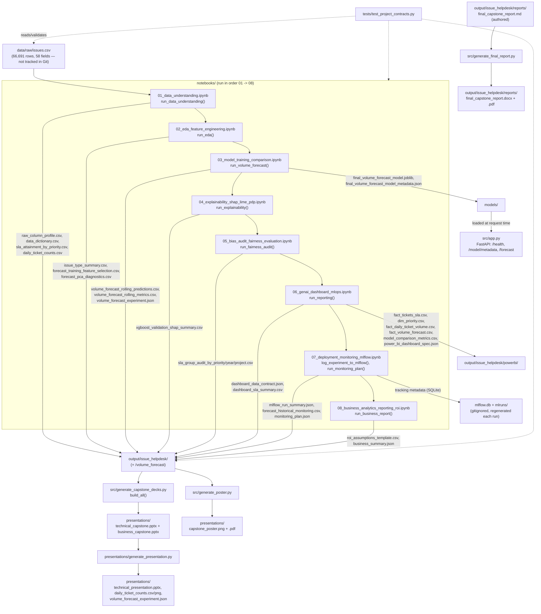

# End-to-end process flow

**In summary:** think of this project as an assembly line with eight stations, one notebook each. Raw ticket data goes in at station one; each station cleans, engineers, models, explains, audits, or packages the results a little further; and everything comes out the other end as reports, dashboards, and a small demo app. This document is the detailed map of that assembly line for anyone who wants to trace exactly which script produces which file.

This documents the actual, current execution sequence of the capstone pipeline,
from the raw source file to the generated reports and presentation decks. It
reflects the real notebook/script call chain in `src/generate_issue_notebooks.py`,
`src/issues_capstone.py`, `src/generate_capstone_decks.py`, and the `presentations/`
scripts as they exist in this repository — no steps are aspirational.

## Diagram

A rendered, numbered version of this same flow (source data through decks/report/app) is generated by `src/generate_process_flow_diagram.py` into `output/issue_helpdesk/process_flow_diagram.png`, and is embedded in `presentations/technical_presentation.md` and the technical slide deck. The Mermaid diagram below is the exact, file-level version of the same sequence.



## Step-by-step sequence

1. **Source input** — `data/raw/issues.csv` is the only raw input. It is never
   modified, moved, or regenerated by any script; it is excluded from Git
   (`.gitignore: data/raw/*`). Its identity is recorded in
   `data/source_verification.json`: Kaggle v1 byte equality and Mendeley v2
   published digest/size match. Coverage and conflicting mirror/original
   license labels remain open (see `data/README.md`).
2. **Notebook 01 — Data understanding** (`run_data_understanding`): parses
   timestamps, scopes the exact `issue_type == Ticket` / documented
   2016+ cohort, profiles all 58 source fields, computes the retrospective
   SLA-reference cohort and the daily ticket-count series.
3. **Notebook 02 — EDA & feature engineering** (`run_eda`): descriptive
   breakdowns by year/priority/weekday, duration correlations, and
   training-only lag/rolling/calendar feature construction plus
   mutual-information selection and PCA diagnostics.
4. **Notebook 03 — Model training & comparison** (`run_volume_forecast`):
   runs the expanding-window, weekly-origin rolling backtest for the 7- and
   30-day horizons across seasonal naive, weekly ETS, XGBoost autoregression
   and MI-selected/PCA Ridge; selects a model per horizon on validation MAE
   and scores the separate final test period. It then refits the primary
   (30-day) validation-selected model on the full available history and
   persists it as the project's single reproducible model artifact via
   `persist_final_model` — `models/final_volume_forecast_model.joblib` plus
   `models/final_volume_forecast_model_metadata.json` (selected model name,
   validation MAE, training data range, feature columns, usage notes, and
   the same historical-backtest limitations that apply project-wide). This
   artifact must be produced with the project's own Python environment
   (`.venv` / the `helpdesk-project-venv` Jupyter kernel, or the Docker
   `analysis` target) — pickling a statsmodels/scikit-learn model under a
   different Python/scipy build is not guaranteed to unpickle elsewhere.
5. **Notebook 04 — Explainability** (`run_explainability`): validation-only
   SHAP/importance summary for the XGBoost challenger (explicitly not
   presented as an explanation of the selected ETS model).
6. **Notebook 05 — Bias/fairness audit** (`run_fairness_audit`): operational
   group breakdowns (priority, year, project) — documented as a descriptive
   audit, not a protected-attribute fairness certification.
7. **Notebook 06 — Dashboard/reporting contract** (`run_reporting`,
   `run_powerbi_export`): builds the machine-readable dashboard data contract
   and summary tables consumed by downstream reporting, then rebuilds a
   dedicated `output/issue_helpdesk/powerbi/` folder covering both the after
   the fact SLA report and the volume forecast (`fact_tickets_sla.csv`,
   `dim_priority.csv`, `fact_daily_ticket_volume.csv`,
   `fact_volume_forecast.csv`, `model_comparison_metrics.csv`, and
   `power_bi_dashboard_spec.json`), plus a `screenshots/` subfolder with one
   rendered sample image per report page (`src/generate_powerbi_screenshots.py`),
   standing in for native Power BI Desktop captures since that application is
   not installed in this environment. Every table and screenshot is
   re-derived from `source_and_ticket_data()` and the persisted rolling
   forecast tables each run, so row counts and date ranges are never
   hardcoded and a larger or refreshed `data/raw/issues.csv` is picked up
   automatically the next time the notebook runs.
8. **Notebook 07 — Deployment readiness, monitoring & experiment tracking**
   (`log_experiment_to_mlflow`, `run_monitoring_plan`): first registers the
   notebook 03 selection outcome and the persisted `models/` artifact as one
   tracked MLflow run — parameters, validation/test metrics, and the artifact
   files themselves — giving the single reproducible model real
   experiment-tracking lineage instead of only static JSON; then produces the
   historical monitoring table and the release-gate/monitoring plan.
   Tracking metadata lives in `mlflow.db` (SQLite, gitignored) with run
   artifacts under `mlruns/` (also gitignored); both are local-only and
   regenerated by re-running this step, so neither is a committed deliverable.
9. **Notebook 08 — Business analytics & ROI** (`run_business_report`):
   business-facing summary and an intentionally blank ROI assumptions
   template (no approved cost/outcome data exists yet).
10. **Deployment app (POC)** (`src/app.py`): a minimal FastAPI service that
    loads the same persisted artifact from step 4 —
    `models/final_volume_forecast_model.joblib` plus its metadata — and the
    canonical `daily_ticket_counts.csv` history, and serves it over
    `/health`, `/model/metadata`, and `/forecast?horizon_days=N` (1–90,
    default 30). It performs no retraining and adds no new metrics; every
    `/forecast` response repeats the same historical-backtest caveat that
    accompanies the artifact everywhere else in this project. Run it with
    `uvicorn src.app:app --reload` (see the root `README.md` for the
    request/response example).
11. **Deck generation** (`src/generate_capstone_decks.py::build_all`) reads the
    artifacts written in steps 2–9 from `output/issue_helpdesk/` and renders
    `technical_capstone.pptx` and `business_capstone.pptx` into
    `presentations/`.
12. **Presentation packaging** (`presentations/generate_presentation.py`) copies
    the technical deck and refreshes the daily-volume chart/data into the
    root `presentations/` folder for distribution alongside both decks and the
    authored narrative in `presentations/technical_presentation.md`.
    `src/generate_poster.py` writes the poster PNG/PDF into this same folder.
13. **Final written report** (`src/generate_final_report.py`) converts the
    authored `output/issue_helpdesk/reports/final_capstone_report.md` —
    the single consolidated, rubric-aligned narrative tying together every
    step above — into `.docx` and `.pdf` via Pandoc and a headless
    Chromium-family browser, so all three formats stay in sync from one
    source.
14. **Contract tests** (`tests/test_project_contracts.py`) validate the
    configuration, notebook integrity, and — where artifacts exist — the
    generated `output/` contents (including the deployment app's
    responses, via FastAPI's `TestClient`, and the final report's rubric
    coverage), independent of step order.

## Supplemental evidence after Notebook 03

`python -m src.verify_dataset_source` checks the current raw CSV against
the retained official digest and size; `--download-kaggle` additionally
compares it byte-for-byte with a fresh pinned public mirror download.
Neither uploads or rewrites the raw source.

`python -m src.generate_coverage_sensitivity` reads the canonical daily
counts/predictions and refits ETS, XGBoost and seasonal naive on a causal
missing-record stress history. It writes only
`output/issue_helpdesk/volume_forecast/coverage_sensitivity/`. Scoring uses
common positive-record targets, not imputed truth. This is post-hoc
sensitivity and does not overwrite model selection or the persisted model.

`python -m src.generate_ets_diagnostics` reads the persisted primary ETS
and saved backtest, writing direct component reconstruction, fitted
residual/ACF evidence and separate held-out errors to
`output/issue_helpdesk/volume_forecast/ets_diagnostics/`. It does not fit
a new model. Both diagnostic packages record input hashes; regenerate
them after their inputs change and before report export. These scripts
are separate from, not additional claims about, the eight notebook runs.

## Canonical output location

Analysis reports, plots, tables and manifests are written under `output/` — see
`output/README.md` for the full layout. Obsolete artifacts from the prior
dataset iteration have been removed. Presentation
deliverables (both decks, packaged charts/data and the poster) share the root
`presentations/` folder with their generators and authored narrative. The single
reproducible model artifact from step 4 (`persist_final_model`) is written to
`models/` instead — `models/final_volume_forecast_model.joblib` and
`models/final_volume_forecast_model_metadata.json` — following the
convention of keeping the one canonical trained model separate from
descriptive reports/figures. Notebook execution results remain embedded in
the deliverable `.ipynb` files under `notebooks/`; source code and authored
documentation remain in their corresponding source folders. Step 8's MLflow
experiment tracking (`log_experiment_to_mlflow`) also uses separate storage: its SQLite tracking database
(`mlflow.db`) and run-artifact store (`mlruns/`) live at the project root but
are gitignored, since they are a regenerable local index over files that are
already committed elsewhere (`models/` and `output/issue_helpdesk/`), not a
unique source of truth.

## Reproducing the flow

```powershell
python -m pip install -r requirements.txt
jupyter nbconvert --to notebook --execute --inplace notebooks\01_data_understanding.ipynb
# ... repeat in order through notebooks\08_business_analytics_reporting_roi.ipynb
python presentations\run_volume_forecast.py
python -m src.verify_dataset_source
python -m src.generate_coverage_sensitivity
python -m src.generate_ets_diagnostics
python presentations\generate_presentation.py
python src\generate_poster.py
python -m unittest discover -s tests -v
```

Or in the provided Python 3.12 container (see the root `README.md` "Container
/ test environment" section and `Dockerfile`). The default Docker target is
the test environment; the full analysis target uses `requirements.txt`.

## Data-rights caveat (carried through every stage)

The raw file matches the downloaded Kaggle v1 bytes and Mendeley v2's
published digest/size; original DOI and CC BY 4.0 are documented. Kaggle's
CC0 label conflicts with the original license and does not establish
relicensing authority. Preserve original attribution and resolve that
label. No stage publishes or bakes the raw file into a Docker image
(`data/raw/` is excluded via `.dockerignore`). Privacy, third-party rights,
provider completeness and service-policy assumptions remain separate.